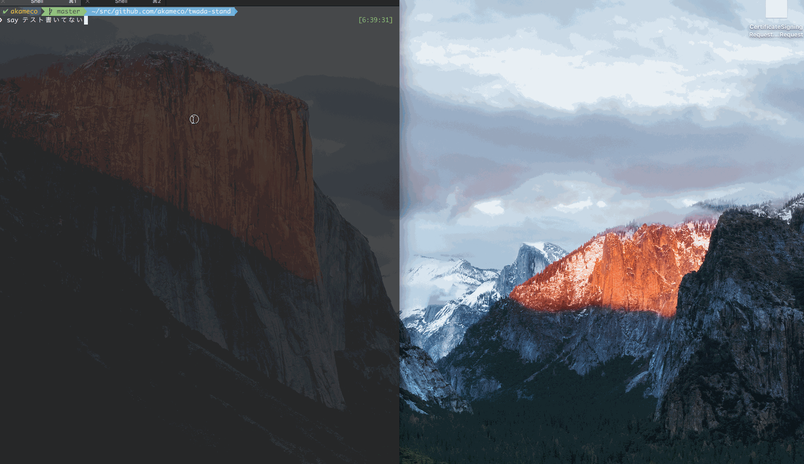

# twada-stand

> テスト書いてないとかお前それ@t-wadaの前で同じこと言えんの

テストを書いてない人の前に例のスタンドが現れます。



## Download

GitHubの[リリースページ](https://github.com/akameco/twada-stand/releases) からダウンロード可能です。

## Installation

```
$ git clone git@github.com:akameco/twada-stand.git
$ cd twada-stand
$ npm install
```

## Usage

```
$ npm start
```

デスクトップの前で、「テスト書いてない」と声に出してつぶやくか、OSXユーザーなら、`say`コマンドで確認できます。

```
$ say テスト書いてない
```

## Tests

テスト書いてない

## License

MIT
